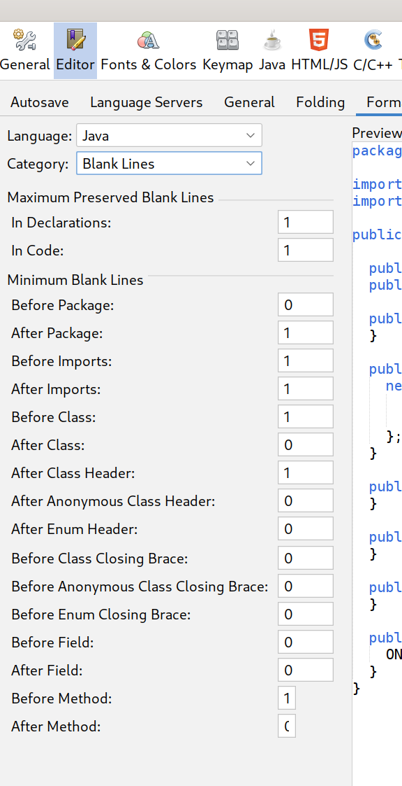

These screenshots show some places where the UI needs tweaking with the FlatLAF theme.
The sizing of certain elements is off.

Aside:

FlatLAF theme should be enabled by default. The MacOS theme
in particular is not very good with its use of dark Grey. FlatLAF also handles high DPI well
on linux by considering the font size and not just GDK_SCALE. On a standard Fedora 33 install with a
4k monitor, both Eclipse and default-theme Netbeans have very tiny buttons/icons, bordering
on unusable. Despite it being 2021 and thus the year of the linux desktop, GTK still does not
support fractional display scaling (Intellij works fine, like FlatLAF).
So the only option is to run eclipse or netbeans like `GDK_SCALE=2.0 ./netbeans`, which
now makes the buttons/icons almost unusably big. Finally, FlatLAF should become the default
theme because it looks great, is being actively maintained, and will provide uniformity across
different platforms.

